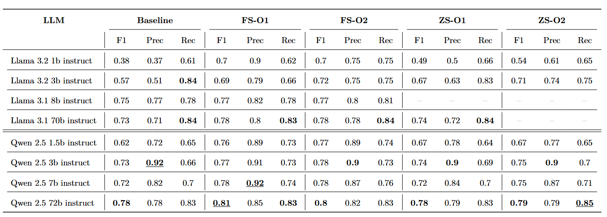

# the-stix-intern

**the-stix-intern** is a framework developed as part of my Masters' thesis "From Threat-Report to STIX-Bundle". 

The framework implements 4 modules to extract STIX Domain Objects (SDOs) and STIX Relationship Objects (SROs) from unstructured threat-reports. It leverages open-source LLMs in various sizes and the library [DSPy](https://dspy.ai/) for automated module optimization. The performance of the implemented modules is on par with comparable approaches from literature that are based on closed-source LLMs from "Open"-AI. The performance of the implemented modules is on par with comparable approaches from literature (e.g. [Time for aCTIon](https://arxiv.org/abs/2307.10214)) that are based on closed-source LLMs like GPT-3.5: 


---

## Features
- **Threat-Report to STIX-Bundle**: Automatically extracts SDOs like Malware, Threat-Actor, Attack-Pattern, Targets and some SROs from Threat-Reports and bundles them as STIX-Bundle 
- **Expanded Dataset**: The evaluation and optimization is based on the LADDER-dataset presented in [Looking Beyond IoCs](https://arxiv.org/abs/2211.01753). The [LADDER-dataset](https://github.com/aiforsec22/IEEEEuroSP23) was enriched with the original Threat-Reports (*.html files) and the annotations were converted into STIX-Bundles. 
- **Open-Source LLMs**: While the Framework can be universally used with any LLM, the development was focused on Open-Source LLMs that are cost-efficient and privacy-preserving. 
- **DSPy Optimization**: The Framework comes with various modules optimized with [MIPROv2](https://dspy.ai/api/optimizers/MIPROv2). 
- **CTI-Metrics**: The evaluation is based on CTI-specific metrics that can accurately assess the correctness of the generated STIX bundles, rather than universal NLP metrics, which are not well-suited for this task.


## Installation & Requirements
The framework itself is compatible with Python > 3.11. However if you want to load the optimized DSPy-Modules it is recommended to use Python 3.11.9 as cloudpickle may raise exceptions if the versions mismatch. Working on a solution to provide the modules in cloudpickle and more independent format for easy use. 


1. Clone GitHub repository:
```bash 
git clone https://github.com/cr4kn4x/the-stix-intern
cd the-stix-intern
```

2. Install requirements: 
```bash 
python -m venv venv 
.\venv\Scripts\activate
pip install -r requirements.txt
```

3. Setup environment variables (API-Keys)
- Create a .env file in the root directory and add your API-Keys if required 
- The example uses [Deepinfra](https://deepinfra.com) as cloud-service for inference but feel free to use any other provider or self hosted LLMs. Inference is based on [LiteLLM](https://www.litellm.ai/) and compatiblity is versatile. 
--- 


## Pick your Module 
The Framework comes with various optimized Zero-Shot and Few-Shot Modules. Every Module is optimized for *one* specific LLM! The following should give you first impression about the achieved performance. 

Basic usage and how to load stored DSPy-Modules can be found in the [the-stix-intern.ipynb](./the-stix-intern.ipynb) notebook. The notebook also presents the usage with the HTML-Parser and the final parsing to STIX-Bundle using the [STIX 2 Python API](https://stix2.readthedocs.io/en/latest/). Optional you can use the webscraper which enables the whole Workflow: URL --> Webscraper --> HTML-Parser --> LLMs --> STIX-Bundle. 

The optimization and benchmark considers following LLMs: 
- [Llama 3.2 1b instruct](https://huggingface.co/meta-llama/Llama-3.2-1B-Instruct)
- [Llama 3.2 3b instruct](https://huggingface.co/meta-llama/Llama-3.2-3B-Instruct)
- [Llama 3.1 8b instruct](https://huggingface.co/meta-llama/Llama-3.1-8B-Instruct)
- [Llama 3.1 70b instruct](https://huggingface.co/meta-llama/Llama-3.1-70B-Instruct)
- [Qwen 2.5 1.5b instruct](https://huggingface.co/Qwen/Qwen2.5-1.5B-Instruct)
- [Qwen 2.5 3b instruct](https://huggingface.co/Qwen/Qwen2.5-3B-Instruct)
- [Qwen 2.5 7b instruct](https://huggingface.co/Qwen/Qwen2.5-7B-Instruct)
- [Qwen 2.5 72b instruct](https://huggingface.co/Qwen/Qwen2.5-72B-Instruct)

#### Malware-Extractor 


#### Threat-Actor-Extractor 


#### Attack-Pattern-Extractor *(includes SRO extraction)*


#### Targets-Extractor *(includes SRO extraction)*

--- 


### Acknowledgments
- [Looking Beyond IoCs: Automatically Extracting Attack Patterns from External CTI](https://arxiv.org/abs/2211.01753) - For the foundation research and [LADDER Dataset](https://github.com/aiforsec22/IEEEEuroSP23)
- [Time for aCTIon: Automated CTI Report Processing for Knowledge Graph Creation](https://arxiv.org/abs/2307.10214) - For providing a solid framework for comparison
- [DSPy](https://dspy.ai/) - For the optimization framework used in this research
- [STIX 2.1](https://oasis-open.github.io/cti-documentation/) - For the structured threat intelligence format

This research was conducted as part of a Master's thesis.
